# Publication plot gallery

This gallery collects the analytical plots appearing in the accepted article
and full online appendix. It deliberately excludes the article's conceptual
workflow diagram and all photo or prediction montages. Raw protest photographs
are not redistributed in this repository.

The accepted Word article stores Figure 1 as an EMF file, which GitHub cannot
display. `article/Figure_1.png` is therefore an author-generated web rendering
from the frozen [`data/df_final.csv`](../data/df_final.csv) input; all eleven
yearly bar counts match the accepted figure. Figures 2, 5, and 6 and Appendix
Figures B1–B3 and C1–C2 are exact copies of the raster assets embedded in the
accepted Word files. File hashes, dimensions, and provenance are recorded in
[`figure_manifest.csv`](figure_manifest.csv).

## Main article

### Figure 1: Campaigns in NAVCO 1.3 in Non-English-Speaking Countries

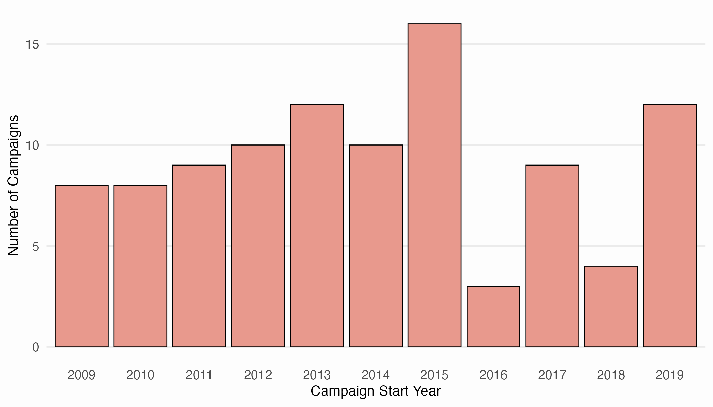

### Figure 2: Protest Banner Photos of Campaigns in NAVCO 1.3 in Non-English-Speaking Countries (yearly photo-count plot)

This is the article's aggregate plot of collected-photo counts by year; it
contains no protest photographs.

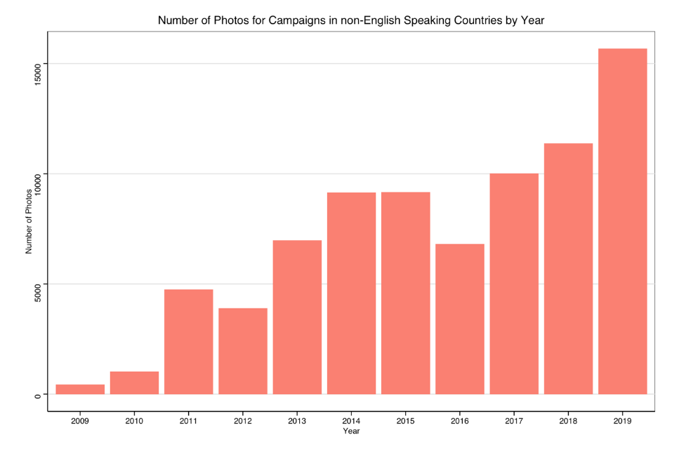

### Figure 5: Distribution of the Proportion of English-language Protest Signs in Campaigns in Non-English-Speaking Countries, 2009-2019

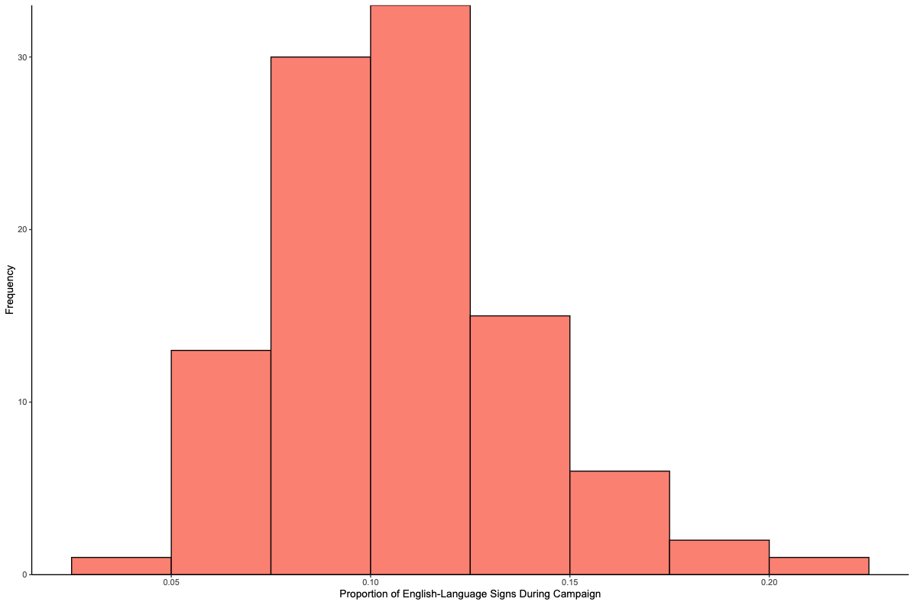

### Figure 6: Scattershot of the Proportion of English-language Protest Signs in Campaigns in Non-English-Speaking Countries, 2009-2019

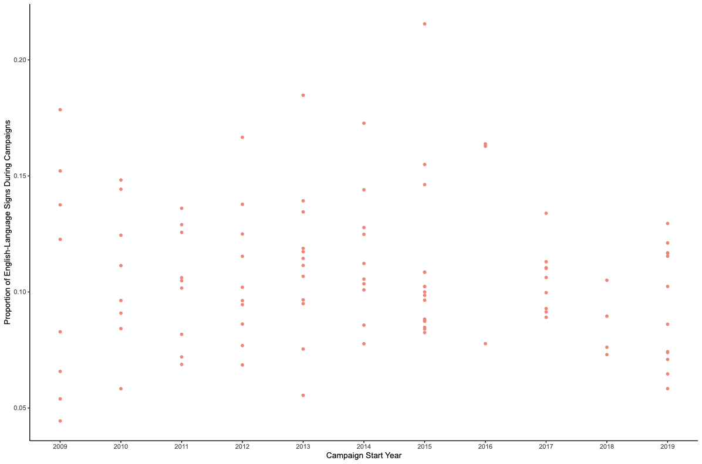

Figures 7–9 below are generated by the one-command replication pipeline; each
is paired with its PDF and numerical plot-data sidecar.

### Figure 7: The Curvilinear Effects of Proportion of English-Language Signs During Campaign

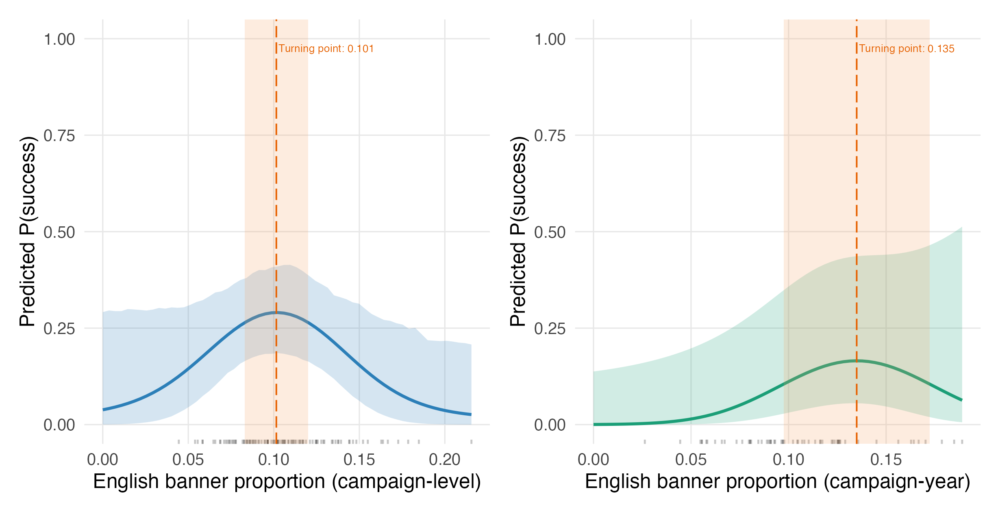

[PDF](../output/figures/Figure_7.pdf) ·
[plot data](../output/figures/Figure_7_plot_data.csv)

### Figure 8: International Trade Freedom X Proportion of English-Language Signs During Campaign

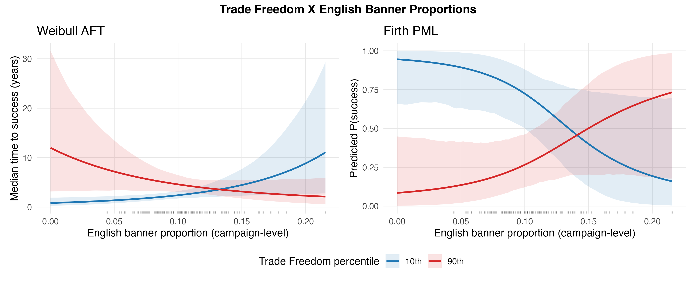

[PDF](../output/figures/Figure_8.pdf) ·
[plot data](../output/figures/Figure_8_plot_data.csv)

### Figure 9: Vulnerability to Domestic Pressure X Proportion of English-Language Signs During Campaign

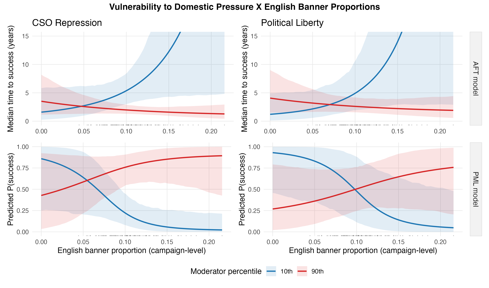

[PDF](../output/figures/Figure_9.pdf) ·
[plot data](../output/figures/Figure_9_plot_data.csv)

## Full online appendix

### Figure B1: Training results

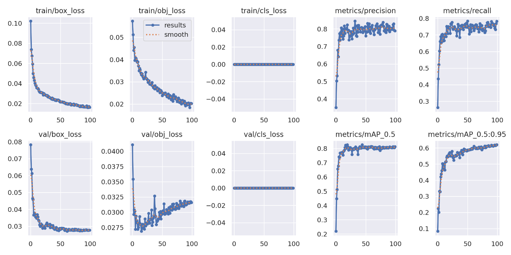

### Figure B2: Evaluation Plots

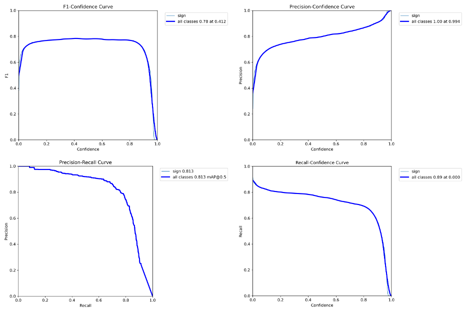

### Figure B3: Distributions of the ground truth bounding boxes

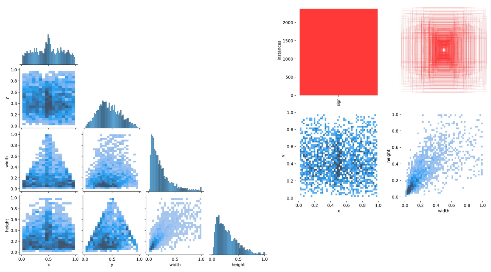

### Appendix Figure C1: Forest plot of the squared English-share (curvature) coefficient

The accepted image is shown below. The code-generated counterpart is available
as [PNG](../output/figures/Figure_C1.png),
[PDF](../output/figures/Figure_C1.pdf), and
[plot data](../output/figures/Figure_C1_plot_data.csv).

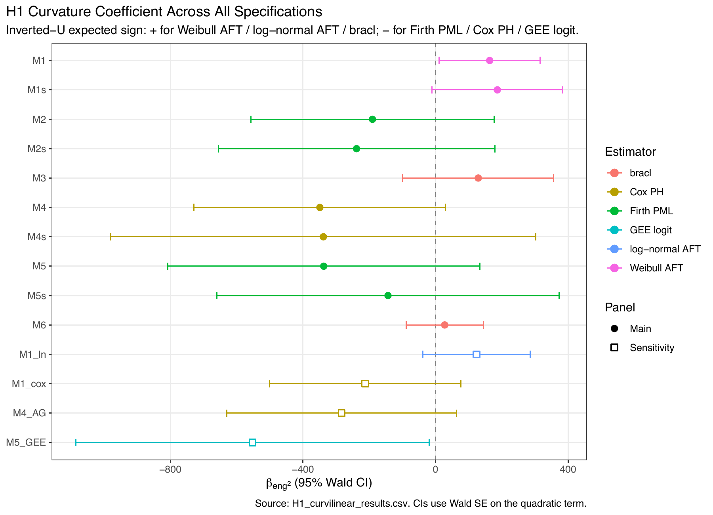

### Appendix Figure C2: Forest plot of the interaction coefficient across all specifications

The accepted image is shown below. The code-generated counterpart is available
as [PNG](../output/figures/Figure_C2.png),
[PDF](../output/figures/Figure_C2.pdf), and
[plot data](../output/figures/Figure_C2_plot_data.csv).

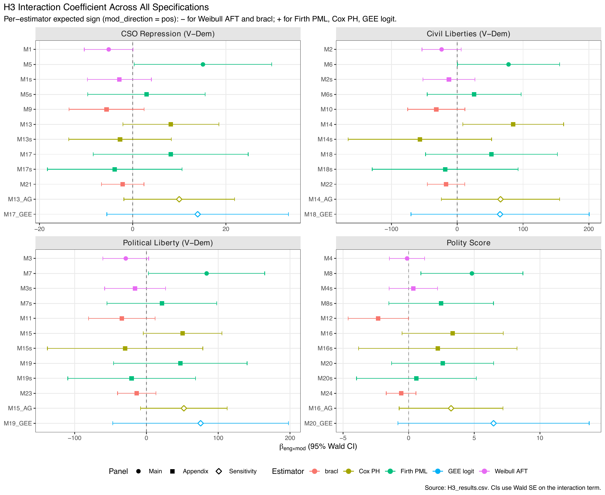

## Provenance note

The accepted C1 and C2 images retain publication annotations that are not part
of the portable code-generated versions. Both are kept intentionally: the
accepted images document what readers see in the appendix, while the generated
files and CSV sidecars document computational reproduction.

The authors have approved public distribution of this replication package.
The accepted appendix and publication-figure images are provided at no charge
for non-commercial, no-derivatives use with citation of the accepted article,
consistent with [Sage's author archiving and re-use guidelines](https://us.sagepub.com/en-us/nam/journal-author-archiving-policies-and-re-use).
Other upstream components remain subject to the rights and citation terms in
the repository's [main README](../README.md); no additional license grant is
implied.
